```{r setup, include=FALSE}
knitr::opts_chunk$set(comment = "#>",
  collapse = TRUE,
  cache = TRUE,
  warning = FALSE,
  message = FALSE,
  dpi = 300,
  cache.lazy = FALSE,
  tidy = "styler",
  out.width = "90%")
pacman::p_load(usmap, shiny, dplyr, plotly, tidyverse, ggplot2, maps, tmap, grid, leaflet, lubridate, readr, kableExtra, magrittr, gridExtra, knitr,revealjs,knitr,png)
options(crayon.enabled = FALSE)

  theme_set(theme_light())
```


# Introduction {data-background="www/straw_back.png"}
<div style = "text-align: left">
In this assignment, we basically focused on the "Domain" column of the strawberry dataset and generate some related EDA.<br>

In our presentation, we will show you how we wrangled our data, what kind of EDA we have done, and what is something we can tell from our work.<br>

The purpose of this assignment is to show our ability of using R to produce documents, presentations, and shiny apps.<br>
</div>

# Data Description {data-background="www/straw_back.png"}
<div style = "text-align: left">
There are 2 datasets collected by USDA and presented by Haviland-- Strawberries.csv and Pesticides.csv. We need to do some wrangling to join the 2 datasets, make them tidy and clean them.

Strawberries.csv --- 3021 rows x 21 columns<br>
Pesticides.csv --- 90 rows x 5 columns
</div>

## Data table {data-background="www/straw_back.png"}

```{r echo=FALSE, message=FALSE}
source("test1025.R")

data2 <- read.csv("Strawberries.csv", header = T)

# wrangle the data
data <- combine() 
data1 <- data %>% head(30)
data1 <- data1 %>% kable("html") %>% 
  kable_styling("striped" ) %>% 
  scroll_box(width = "100%", height = "400px")

data1
  # column_spec(2:4, bold = T) %>%
  # row_spec(3:5, bold = T, color = "white", background = "#D7261E")

# data =  plyr::mutate(table1[1:10, ],
#                    perm = cell_spec(State,"html",
#                    color = "white",
#                    bold = T,
#                    background = spec_color(1:10,
#                    end = 0.9,
#                    option = "A",
#                    direction = -1)),
#   shape = ifelse(Value > 0.15,
#                  cell_spec(State,
#                            "html",
#                            color = "white",
#                            background = "#D7261E",
#                            bold = T),
#                  cell_spec(Value, "html",
#                           color = "green",
#                            bold = T)))
```

# EDA {data-background="www/straw_back.png"}
<div style = "text-align: left">
- Organic

- Chemicals

- Toxins
</div>

## Strawberry distribution {data-background="www/straw_back.png"}


# Organic Rate {data-background="www/straw_back.png"}
<div style = "text-align: left">
This is the organic rate in each state in 2019
</div>
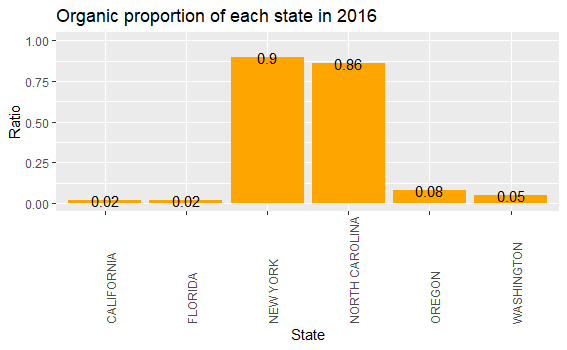
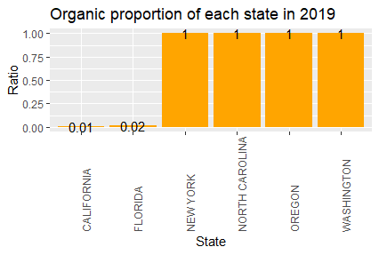

## Organic CWT {data-background="www/straw_back.png"}
<figure>

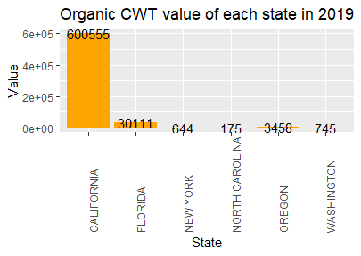
</figure>

## Organic Price {data-background="www/straw_back.png"}
<figure>

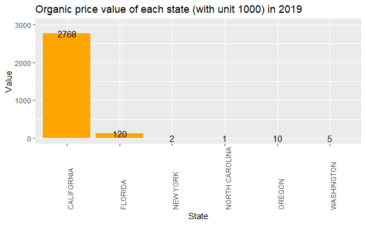
</figure>

# Chemical {data-background="www/straw_back.png"}
<div style = "text-align: left">
<br>Overview of Chemical usage in 2019 and 2016<br>
</div>
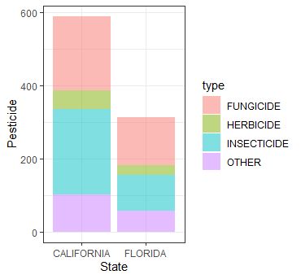
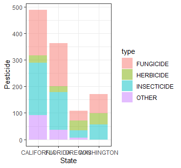

## Chemical Percentage in 2016

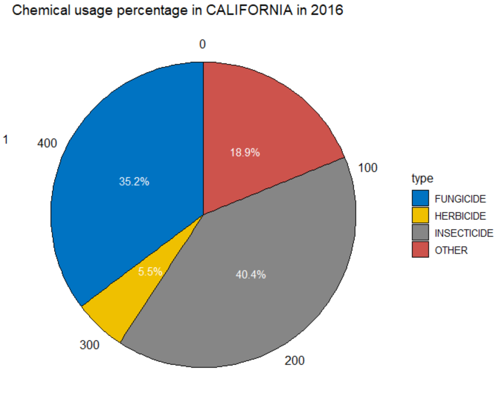
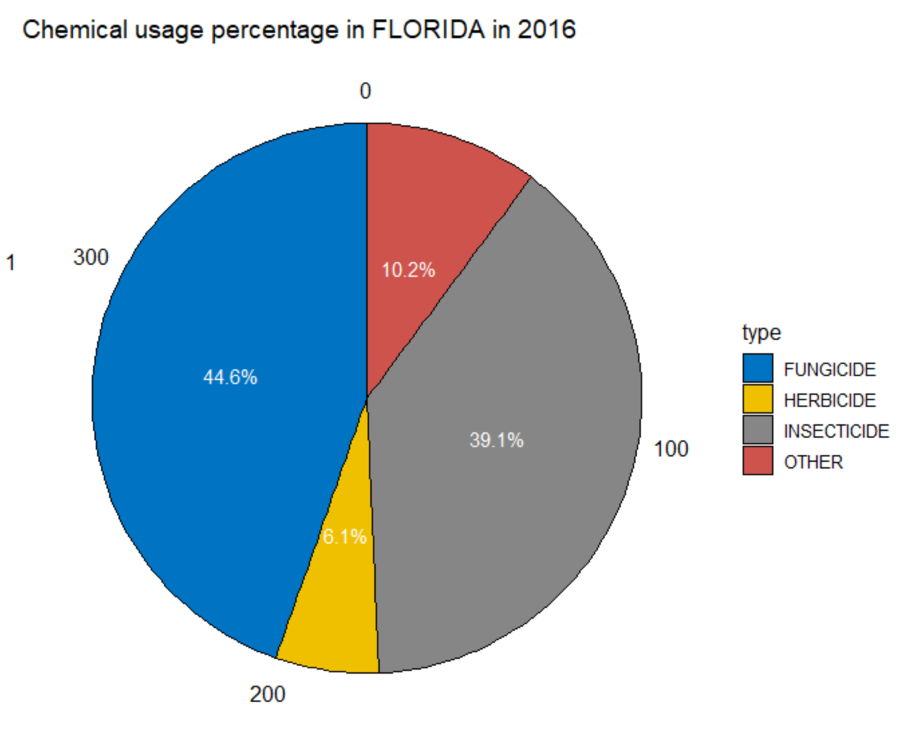

## Chemical Percentage in 2019

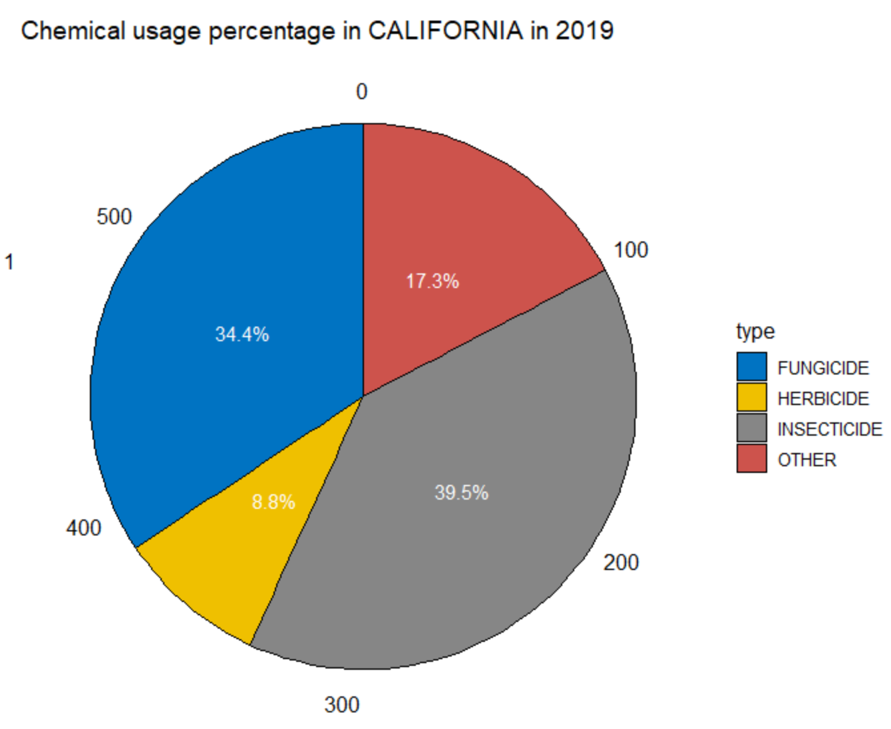
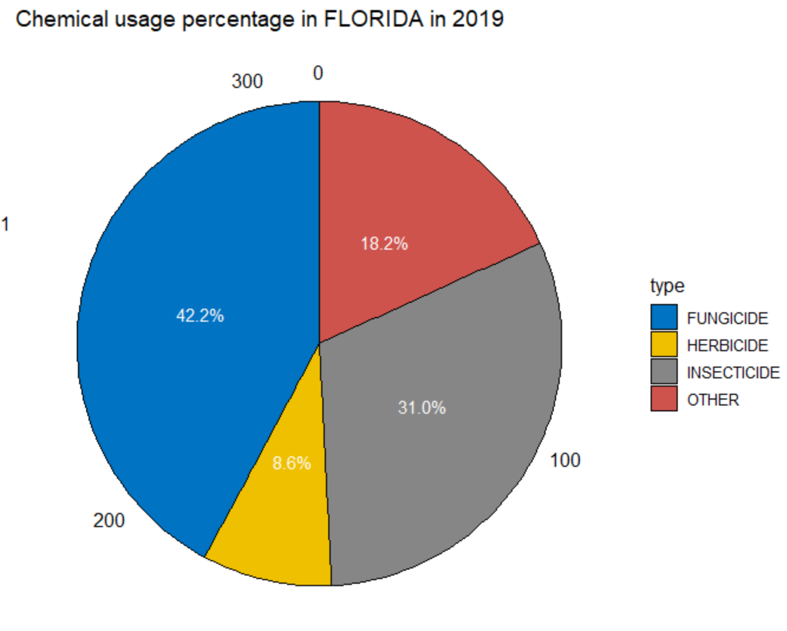

# Chemical Usage {data-background="www/straw_back.png"}
<div style = "text-align: left">
This part we will show the chemical people use to grow strawberries of each state in 2019.
</div>
- [2019-California](figures/plotly_test.html)<br>
- [2019-Florida](figures/plotly_f.html)


# Toxin Analysis {data-background="www/straw_back.png"}
<figure>
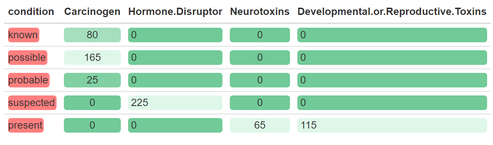
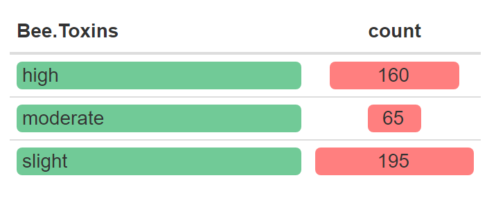
</figure>

# Conclusion {data-background="www/straw_back.png"}
- Since the dataset in imbalanced, most observations are from California, thus it is almost meaningless to compare the sum of organic value. And since all observations from New York State, North Carolina, Oregon and Washington are organic in 2019, it is meaningless to compare the Organic proportions  in 2016 and 2019 as well.

- Chemical substances affect both humans and bees. Among the above-mentioned chemical substances, there are 53 species that have greater side effects on bees. Most of these chemicals contain Carcinogen and Hormone Disruptor, which can cause harm to humans. Therefore, we call for reducing the use of chemical.

- 

# Shiny {data-background="www/straw_back.png"}

[Strawberry](https://yulijin.shinyapps.io/midterm/)

# Reference {data-background="www/straw_back.png"}
Images - [Bing images -- Strawberry](https://www.bing.com/images/search?view=detailV2&ccid=UFTDjx%2fJ&id=FE80ECCBC548846EACCF294A20EB1386D8198681&thid=OIP.UFTDjx_JY7oF4lzUKhe7nAHaHa&mediaurl=https%3a%2f%2fth.bing.com%2fth%2fid%2fR.5054c38f1fc963ba05e25cd42a17bb9c%3frik%3dgYYZ2IYT6yBKKQ%26riu%3dhttp%253a%252f%252fclipart-library.com%252fimg%252f2082953.jpg%26ehk%3doyGHrXIhE1S03m5xiDxNvNlgRqXlnjvADfGkZUqhMsA%253d%26risl%3d%26pid%3dImgRaw%26r%3d0&exph=1252&expw=1252&q=Cute+Animated+Strawberry&simid=608025162911208268&FORM=IRPRST&ck=AE3AFE67B255B828FDD5068D5014DC81&selectedIndex=12)
