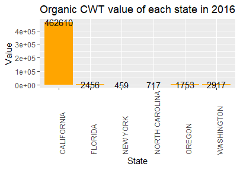
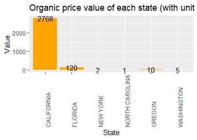

```{r setup, include=FALSE}
knitr::opts_chunk$set(comment = "#>",
  collapse = TRUE,
  cache = TRUE,
  warning = FALSE,
  message = FALSE,
  dpi = 300,
  cache.lazy = FALSE,
  tidy = "styler",
  out.width = "90%",
  fig.align = "center",
  fig.width = 10,
  fig.height = 4)
pacman::p_load(usmap, shiny, dplyr, tidyverse, ggplot2, maps, tmap, grid, leaflet, lubridate, readr, kableExtra, magrittr, gridExtra, knitr,revealjs,knitr,png)
options(crayon.enabled = FALSE)

  theme_set(theme_light())
```


# Introduction {data-background="www/straw_back.png"}

<br>
<div style="font-size:16pt;margin-left:40px">
<b>The way to input some figures</b>

</div>


# Data Description {data-background="www/straw_back.png"}


<http://rmarkdown.rstudio.com>.


## Data table {data-background="www/straw_back.png"}

```{r echo=FALSE, message=FALSE}
source("test1025.R")
data <- combine() %>% head(30)
data <- data %>% kable("html") %>% 
  kable_styling("striped" ) %>% 
  scroll_box(width = "100%", height = "500px")
data
  # column_spec(2:4, bold = T) %>%
  # row_spec(3:5, bold = T, color = "white", background = "#D7261E")

# data =  plyr::mutate(table1[1:10, ],
#                    perm = cell_spec(State,"html",
#                    color = "white",
#                    bold = T,
#                    background = spec_color(1:10,
#                    end = 0.9,
#                    option = "A",
#                    direction = -1)),
#   shape = ifelse(Value > 0.15,
#                  cell_spec(State,
#                            "html",
#                            color = "white",
#                            background = "#D7261E",
#                            bold = T),
#                  cell_spec(Value, "html",
#                           color = "green",
#                            bold = T)))
#https://blog.csdn.net/qq_37379316/article/details/114417360

```

# EDA about strawberries {data-background="www/straw_back.png"}

## Strawberry distribution {data-background="www/straw_back.png"}

```{r echo=FALSE, include=FALSE, message=FALSE}
 # template: reveal_template.html
    # theme: white
    # highlight: pygments 
    # css: reveal.css
# 
# <section data-background-image="images/title-io1.svg";
#          data-background-size:"contain"
#          background-repeat: no-repeat;>
# </section>
```

## Strawberry in different year {data-background="www/straw_back.png"}

# Organic/Non-organic rate and Pesticide type {data-background="www/straw_back.png"}

## Organic Rate
<div>
This is the organic rate in each state in 2019<br>
</div>


## Organic CWT



## Organic Price
<figure>



</figure>

# Conclusion {data-background="www/straw_back.png"}


## Slide with R Code and Output {data-background="www/straw_back.png"}

```{r}
# <pre><figcaption> Fig1 &#9;&#9;&#9 Fig2 </figcaption></pre>
```

## Slide with Plot {data-background="www/straw_back.png"}

```{r, echo=FALSE}

```

# Shiny {data-background="www/straw_back.png"}

[Strawberry](https://yulijin.shinyapps.io/midterm/)

